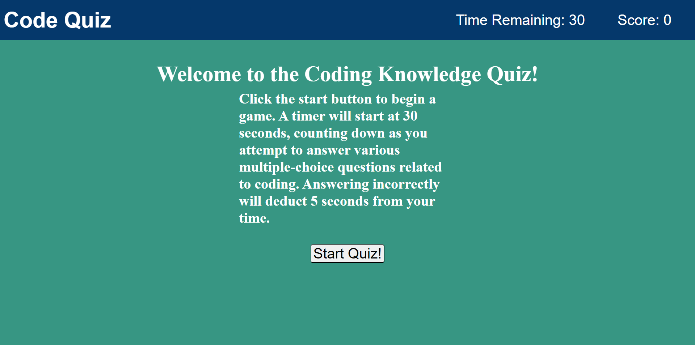

# Code Quiz

## Description

This is a Code Quiz made using JavaScript. When you begin the game, a timer will start at 30 seconds. The time will go down as you answer various multiple-choice questions related to coding. Each time you get an answer correct, it will add one to your score. 
if you answer incorrectly, 5 seconds will be deducted from the time. When the timer reaches zero or you have answered all of the questions, you are prompted to enter your initials. Your initials and score are then saved to the local storage.

## Usage

https://rb2277.github.io/code-quiz/

## Credits

N/A

## License

N/A
